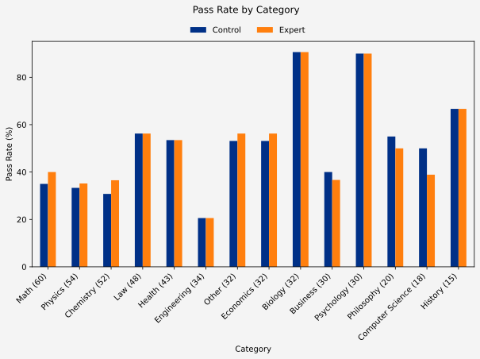
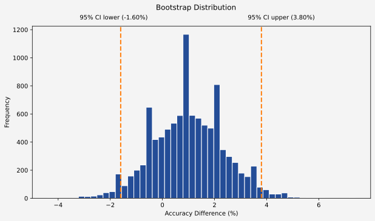
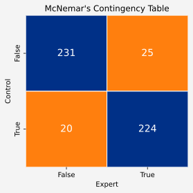

# 🧪 Expert Persona Eval

## Research Question

Does prompting an LLM with an expert persona improve its accuracy on reasoning tasks?

## Hypothesis

An expert persona will improve model accuracy compared with an otherwise identical prompt without a persona.

## Evaluation Setup

| Element         | Details                                              |
| --------------- | ---------------------------------------------------- |
| **Conditions**  | No persona (control) · Expert persona (experimental) |
| **Dataset**     | MMLU-Pro — 500 randomly selected questions           |
| **Model**       | `gemini-2.5-flash-lite`                              |
| **Temperature** | 0                                                    |
| **Analysis**    | Bootstrapping · Exact McNemar's test                 |

The model temperature was set to 0 to minimise randomness and isolate the effect of the persona.

**Key technologies:** Python · Jupyter · Pandas · NumPy · Google Gemini API · Matplotlib

## Dataset

The evaluation uses the **MMLU-Pro** dataset, loaded from Hugging Face.

A random sample of 500 questions was selected. A filtering mechanism prevents questions previously answered under the same prompt version and condition from being processed again. This allows the sample to be incrementally increased across runs using the same random seed.

## Methodology

### Prompting

The control and experimental prompts are identical except that the experimental condition begins with an expert persona:

```text
You are an expert in physics.

I will give you a question and some options.

I want you to only return the letter (A-J) of the correct answer in brackets.

Example answer:
(C)

Do not return anything else. Do not explain your reasoning.

Even if you think you do not have enough information to answer the question, try anyway.
```

The model is instructed to return only the letter corresponding to the correct answer.

### Response Parsing

Strict parsing identifies three outcomes:

* **Pass** — the correct answer appears in brackets and no incorrect answer does
* **Fail** — an incorrect answer appears in brackets and the correct answer does not
* **Parse failure** — neither condition is satisfied

Parse failures are retried on subsequent runs.

### Results Storage

Each successful LLM response is stored as a JSON object in a JSONL file, including pass, fail and parse-failure outcomes. Results are saved immediately after each response to allow interrupted runs to resume.

### Statistical Analysis

**Bootstrapping** estimates uncertainty around the observed difference in pass rates.

**Exact McNemar's test** assesses whether the paired difference between conditions is statistically significant.

## Results

### Descriptive Statistics

| Statistic             |                 Value |
| --------------------- | --------------------: |
| **Control pass rate** |                 48.8% |
| **Expert pass rate**  |                 49.8% |
| **Difference**        | +1.0 percentage point |



### Inferential Statistics

| Method                           |          Result |
| -------------------------------- | --------------: |
| **Bootstrap SE**                 |           1.36% |
| **Bootstrap CI**                 | [-1.60%, 3.80%] |
| **Exact McNemar's test p-value** |            0.55 |





### Interpretation

The results provide no convincing evidence that an expert persona improves the performance of `gemini-2.5-flash-lite` on MMLU-Pro.

Although the expert condition achieved a pass rate 1 percentage point higher than the control, the confidence interval includes zero and the Exact McNemar's test is not statistically significant. The observed difference is therefore consistent with random variation.

## Limitations

* **Dataset contamination:** MMLU-Pro is a public benchmark and may have appeared in the model's training data, meaning some answers may reflect memorisation rather than reasoning.
* **Sample size:** The evaluation uses only 500 questions.
* **Single run:** Each question is evaluated once per condition.
* **Simple persona:** The experimental persona consists of a relatively minimal expert instruction.
* **Single model:** Only `gemini-2.5-flash-lite` is evaluated, limiting generalisability.
* **Benchmark scope:** Results on MMLU-Pro may not translate directly to other datasets or real-world reasoning tasks.
