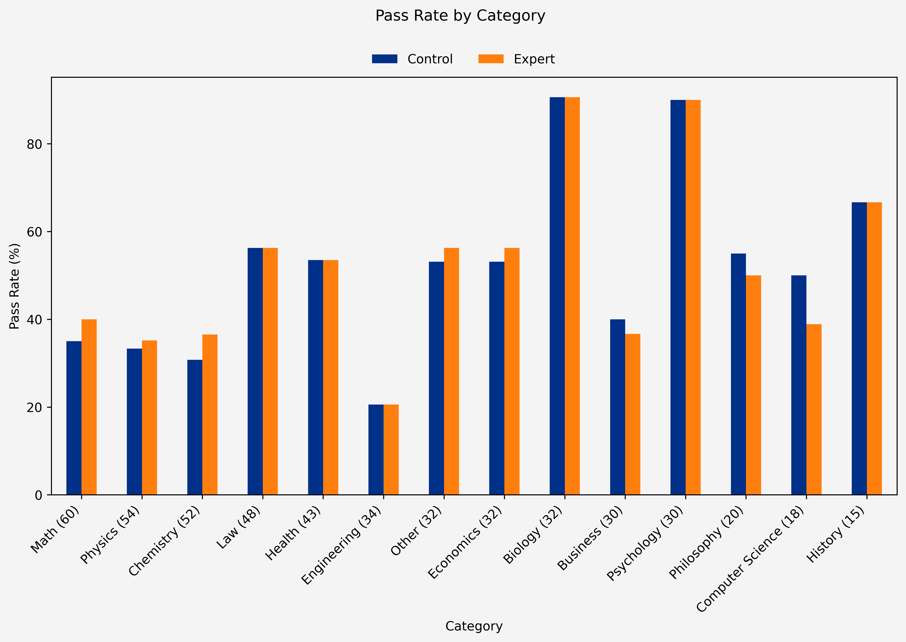
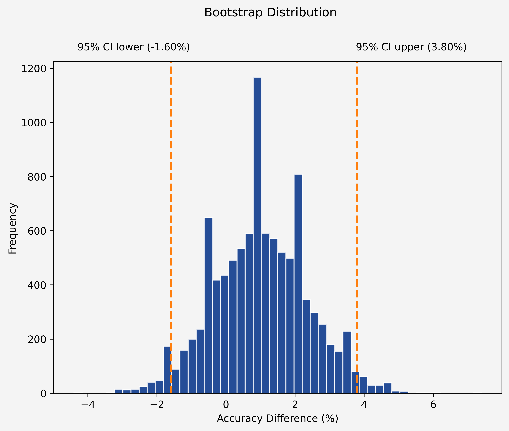

# 🧪 Expert Persona Eval

An evaluation testing whether prompting an LLM with an expert persona improves accuracy on reasoning tasks.

The experiment compares two conditions, a control condition with no persona and an experimental condition with an expert persona, on the same set of 500 randomly selected questions from the MMLU-Pro dataset. Both conditions use the gemini-2.5-flash-lite model at temperature 0 to minimise randomness, isolating the effect of the persona itself. The results are analysed using bootstrapping to estimate uncertainty around the observed effect size and the Exact McNemar's test to assess statistical significance. It finds a lack of evidence for expert persona efficacy.

**Key technologies:** Python, Jupyter, Pandas, NumPy, Google Gemini API, Matplotlib.

## 🔍 Overview

This evaluation involves the following steps: 

1. Design elements
2. Data collection
3. Data analysis
4. Interpretation

## 📐 Design elements

The evaluation was designed based on the following core elements:

| Element | Details |
|---|---|
| **Conditions** | No persona (control) · Expert persona (experimental) |
| **Dataset** | MMLU-Pro — 500 randomly selected questions |
| **Model(s)** | gemini-2.5-flash-lite |
| **LLM settings** | Temperature: 0 |
| **Evaluation** | Bootstrapping · Exact McNemar's test |

## 🛢️ Data collection

### Dataset 

The MMLU-Pro dataset is loaded in from Hugging Face. 

### Sampling

The dataset is randomly sampled. 

### Filtering

A filtering mechanism is used to prevent previously answered questions under the same prompt version and condition from being processed twice. This allows the user to set the same random seed and incrementally increase the sample number rather than try to process 500 questions for each condition in one run (this would take a long time). 

### Prompting

The following example prompt is constructed for the expert condition (the control condion prompt is identical minus the first line): 

```text
You are an expert in physics.

I will give you a question and some options.

I want you to only return the letter (A-J) of the correct answer in brackets.

Example answer:
(C)

Do not return anything else. Do not explain your reasoning.

Even if you think you do not have enough information to answer the question, try anyway.

Question:
An airplane is flying at Mach 1.75 at an altitude of 8000 m, where the speed of sound is How long after the plane passes directly overhead will you hear the sonic boom? (Unit: m/s)

Options:
['800', '520', '500', '700', '750', '650', '850', '450', '560', '600']
```

### Response parsing

The model is asked to return the corresponding letter of the correct answer in brackets. This proves quite useful, since despite telling the model not to explain its reasoning, it often does. Long answers provide more oppourtunities for misparsing. A letter encapsulated in brackets is often more unique and easier to parse than a letter on its own (look at the first letter of this sentence: 'A lot of sentences contain single letters...').

The parsing logic that follows is quite strict. If the bracket encapsulated letter of the correct answer is found and none of the incorrect answers, it is marked as having passed. If an incorect letter is found and not the correct letter, it is marked as having failed. If neither of these conditions is true, it is marked as a parse failure. Parse failures are retried on subsequent runs. 

### Results storage

The data generated by every question for which we receive a successful response from the LLM (pass, fail or parse_failure) is saved as a new json object in a jsonl file. Data from successful responses is saved each time before moving onto the next question. 


## 📊 Data analysis

### Descriptive statistics

| Statistic | Value |
|---|---|
| **Control pass rate** | 48.8% |
| **Expert pass rate** | 49.8% |
| **Difference** | 1% |



## 🎲 Inferential statistics

| Method | Result |
|---|---|
| **Bootstrap SE** | 1.36% |
| **Bootstrap CI** | [-1.60%, 3.80%] |
| **Exact McNemar's test p-value** | 0.55 |




## 💡 Interpretation

Within the scope of this experiment, there is no convincing evidence that an expert persona improves the performance of `gemini-2.5-flash-lite` on the MMLU-Pro dataset. Although the expert persona achieved a pass rate that was 1 percentage point higher than the control condition, both bootstrapping and the Exact McNemar's test indicate that this difference is consistent with random variation rather than a genuine effect. Overall, these results illustrate the importance of complementing descriptive statistics with inferential statistical methods. Small differences in benchmark scores can sometimes occur by chance.

## ⚠️ Weaknesses

The weaknesses of this experiment include the fact that it uses the MMLU-Pro dataset, a well-known public dataset that may have seeped into the model's training data, leading to data contamination (i.e. when a model recalls an answer rather than using reasoning to work it out). The experiment also uses only 500 unique questions, conducts a single run for each question, assigns a relatively simple expert persona with little detail and tests only a single model, limiting the wider generalisability of the findings.


